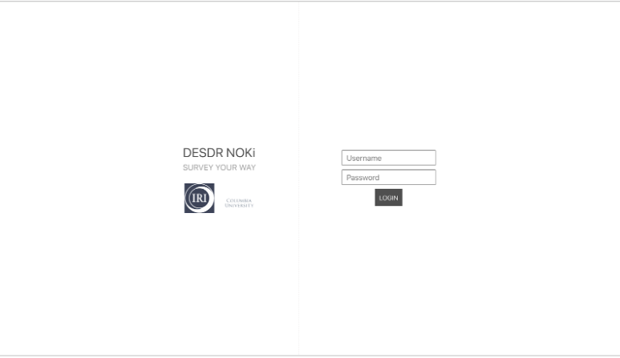
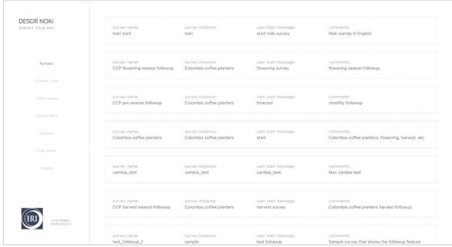

The NOKi Admin Page is a web application designed for administrators to create, manage, and monitor their customized NOKi deployments. This section covers the main functionalities available in the admin interface.

## 2.1 Login and Navigation

To access the Admin Page, you'll need login credentials. For security purposes, contact the NOKi team to request access.

The login page allows you to enter your username and password. After logging in, you'll be directed to the main dashboard of surveys with a navigation menu.

## 2.2 Main Page

> **Main Dashboard Interface**
> 
> The main page displays:
> - Navigation menu on the left
> - List of existing surveys in the center
> - Survey management options
> - "New Survey" button to create surveys
