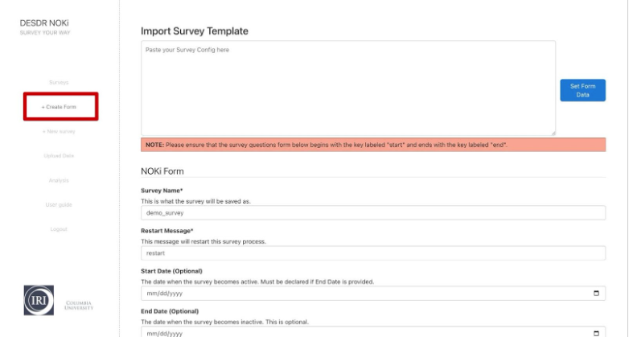

Instead of building surveys from scratch using the instructions in section 5, you can also design your survey, including its question flow and format, by using the dropdown functionality available under **+ Create Form** in the left panel.

Let's explore the purpose of each text box and how to use them to create a form.

## Form Configuration Fields

**Survey name:** A unique identifier for the survey. This name must not already exist in the system, ensuring all surveys have distinct names. Fill in a unique survey name.

**Restart Message:** The default trigger to start a survey is "start." However, you can customize the message that users can send to restart the survey, either during or after completing it.

**Start Date:** The date when the survey becomes active and available for participants. This allows you to schedule surveys in advance and control when they can be accessed.

**End Date:** An optional setting that defines when the survey will become inactive and no longer available to users.

**Inactive Survey Response:** If a user attempts to access a survey that is inactive, either because it hasn't yet been launched or because it has already concluded, you can set a custom message to be displayed.

## Structuring Survey Questions

Let's take a closer look at how to structure and define your survey questions:

By default, the first key in the JSON form is set to **"start."** You can specify the message that will be shown when the user sends the "start" keyword by entering it in the **Message-1** textbox. Optionally, you can add additional messages using the blue **+** button in the message section.

If you want to collect information from the user in your start message, such as their name, you can set the question type to **"var"**. Then, create a message variable (for example, s1, which we used in Section 5 of this user guide to collect and store the survey taker's name) by clicking the **+** button in the **Message Variable** section. This variable can be used in subsequent messages, where its value will automatically be substituted in place of the variable reference.

You can add more questions by clicking the large blue **+** button at the bottom right of the screen. For each question, you can define the question type, message, and message variable according to your requirements.

## Multiple Choice Questions

For multiple-choice questions, use the **MCQ Options** section to specify the possible answers. In this section:

- The **left box** represents the key that the user will send as their response (e.g., "1", "A").
- The **right box** holds the actual answer value corresponding to that key (e.g., "Yes", "10").

**Note:** The **Next Question** dropdown is automatically populated with the keys of the questions you've created. Therefore, after defining your start message, you need to create at least one additional question and assign it a key. This ensures that the new question appears in the dropdown, allowing you to select it as the next step the user is directed to after the start message. This same process applies to all subsequent questions—each one must have a defined key to be selectable as the next destination in the flow.

## Generating and Saving Your Form

After creating all your survey questions, you can generate a JSON of your survey using the **Generate JSON** button. You can then choose to save the form, clear it, or copy the generated JSON.

This visual form builder provides an intuitive alternative to manually writing JSON scripts, making survey creation accessible to users who prefer a graphical interface over direct code editing.