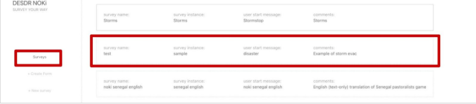
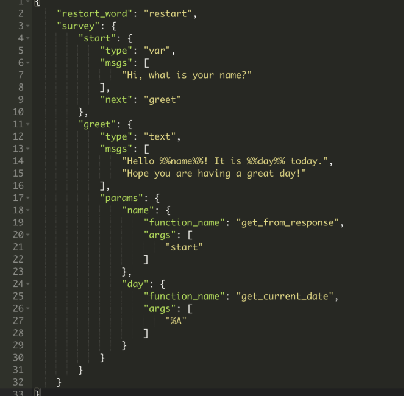

NOKi enables users to create flexible and dynamic WhatsApp surveys for data collection. This guide walks you through building a basic survey, which you can easily adapt to your specific needs. Using custom functions, you can define question flows based on user responses, dynamically modify messages, sign users up for follow-ups, and much more.

Right-click on **+ New Survey** on the left pane and open it in a new tab. You'll see a form with some text boxes and a script editor. Let's understand what these text boxes mean:


> **Survey Creation Form**
> 
> The form contains the following fields:
> - Survey name field
> - Instance name field
> - Start message field
> - Comments field
> - Script editor with JSON content

**Survey name:** A unique identifier for the survey. This name must not already exist in the system, ensuring all surveys have distinct names. Fill in a unique survey name.

**Instance name:** Instance is used to group together similar surveys. For example, a set of surveys meant to collect information from coffee planters in Colombia can have an instance name such as - 'Coffee planters'. For now, fill in this text box with the value **test**.

**Start message:** This is a unique message that the user sends to start the survey. Fill in with a unique start message, something like **start <survey name>**.

**Comments:** This should be a helpful description of the survey

**Script:** This is where the survey's flow of messages is defined in JSON format. You should see a sample JSON script. Delete the sample script and paste the following:


Now, click on the **Create Survey** button below the script editor.


If your **Survey Name** and **Start Message** are unique, you'll be redirected to the **Survey** page. Your newly created survey will be at the bottom of the list.



## Testing Your Survey

Before moving on, let's test the survey you created.

- Take out your phone and open WhatsApp. Add a new contact: **+1 (646) 217-0881**, name it whatever you like.
- Send the Start message of the survey you created to this number.

This should start the survey, and you should get a reply - "Hi, what is your name?". Reply with a random name like "John Doe". After sending this, you should receive 2 more messages - "Hello there!" and "Hope you are having a great day!"

**Voila! It's that easy to create a survey.**

## Important Notes

**Please note:** When you start a survey by sending its start message to the WhatsApp number, the system creates an active survey session. During this session, all messages you send are considered responses to that survey, and you cannot start another survey simultaneously.

The session ends when you complete the survey or remain inactive for more than 24 hours. If you wish to exit a survey early, send **"#bye"** (without quotes). Once the session ends, you can start a new survey or restart the same one by sending the respective start message.

## 3.1 Understanding a JSON Script

Before we dive into the structure of the script above, it is recommended that you familiarize yourself with JSON syntax. Here is a good resource: [An Introduction to JSON](https://www.digitalocean.com/community/tutorials/an-introduction-to-json)

Let's understand the JSON script now. On the left pane, click on **Surveys**, find your survey, and click on it. This will take you to the edit page. Aside from the survey name, you can edit anything here. The JSON script is where you define the messages and the flow of the survey. Some of the key elements are:

**restart_word:** The value of this key is used by the user to restart the survey while they are in an active session.

You can try it out! Send the Start message of the survey to the WhatsApp number. When you get the reply - "Hi, what is your name?", send **restart**. This would restart the survey, and you'll see the first message again.

**survey:** This holds the messages and their order in the form of states. The states are defined as key-value pairs. The entry point of the survey is defined by the key **"start"**, which is mandatory for every survey.

**start:** The value of this state is another object with key-value pairs:

- **"type"**: specifies the type of response that we expect from the user. This can be of 3 types:
  - **"var"**: used to receive text responses from the user. eg, a name.
  - **"text"**: used in the last state of the survey, where we don't expect a response from the user. For instance, we used this type in the "greet" state of the basic survey we created in the section above.  - **"mcq"**: used when we give users a multiple-choice question and expect one of the option numbers as a response. For instance:


- **"msgs"**: This is an array of messages to be sent to the user. The system sends these messages in order, with a pause of 1-2 seconds between them.

- **"next"**: Here we specify which state to move to next after the user has responded to the msgs in the current state. In the example, we move to the "greet" state.

Please note that, except for the "start" state, the other states can be named anything you wish. For example, you can change the state name from "greet" to "bye bye"

**"greet"**: This is the last state of this survey. Notice that the "type" is text, which means that we don't expect any response from the user.

## 3.2 Adding Parameters

Parameters can make your messages dynamic. Let's start by modifying the survey we created in the previous step. Copy the script below, go to the edit page of your survey, and paste it into the script editor. Then, click **Save Changes** at the bottom of the page.



Test the changes using WhatsApp. Once you've saved the changes, the updates will be applied immediately. Send the start message and complete the survey. You'll notice that the final message greets you by name and includes today's date. This level of dynamism is made possible through the use of Parameters.

We've added two parameters to the survey: **%%name%%** and **%%day%%** in the "msgs" of the "greet" state. Anything between two percent signs (e.g., **%%parameter%%**) is considered a parameter and will be dynamically substituted while the user is taking the survey. We need to define how the values for these parameters are determined using the **params** object. Here's how it works for our two parameters:

**"name"**: The name parameter should be substituted with the user's response from the previous state (i.e., the "start" state, where the user entered their name). This is handled by the **get_from_response** function, with the argument "start" to fetch the user's response from that state. You can use various other functions to retrieve data from different states. Check the functions reference for details on available functions and their supported arguments.

**"day"**: The day parameter should be substituted with the current day when the user takes the survey. To get this, we use the **get_current_date** function. This function accepts the date format as "args". Here, we have used **"%A"** which returns the weekday. You can replace %A with any valid format (see [strftime.org](https://strftime.org) for more options).

For example: change the args from **"%A"** to **"%m-%d-%Y"** and save the changes. When you test the survey on WhatsApp, you'll see that the last message greets you with the full date.

## 3.3 Next State Control

There are use cases where you might want to decide the next state based on some condition.

For instance, an interesting use case is when we want to move to a state based on the user's response in one of the previous states. For example, let's say we have a survey that asks user their language preference. Depending on their response, we can then direct them to a state where all the survey messages are in the selected language.

Here's an example of a multiple-choice question with conditional next states:

```json
{
  "restart_word": "restart",
  "survey": {
    "start": {
      "type": "var",
      "msgs": [
        "Hi, what is your name?"
      ],
      "next": "evacuation_choice"
    },
    "evacuation_choice": {
      "type": "mcq",
      "msgs": [
        "In an event of a storm, would you choose to evacuate?",
        "1) Yes",
        "2) No"
      ],
      "next": {
        "1": "evacuate_transport",
        "2": "no_evacuate_reason"
      }
    },
    "evacuate_transport": {
      "type": "mcq",
      "msgs": [
        "Do you think other players with your character would:",
        "1) Drive",
        "2) Take public transit?"
      ],
      "next": "end"
    },
    "no_evacuate_reason": {
      "type": "mcq",
      "msgs": [
        "Guess why doesn't %%name%% evacuate:",
        "1) Because they want to protect their home",
        "2) Because they don't have a transportation option",
        "3) Because they don't have a place to stay",
        "4) Because they don't think the storm is really serious enough"
      ],
      "params": {
        "name": {
          "function": "get_from_response",
          "args": ["start"]
        }
      },
      "next": "end"
    },
    "end": {
      "type": "text",
      "msgs": [
        "Thank you for participating in the survey!"
      ]
    }
  }
}
```

In this example:

- **type: "mcq"** indicates a multiple-choice question
- **next:** Contains a mapping from user responses to next states
- If the user selects "1" (Yes), they go to the "evacuate_transport" state
- If the user selects "2" (No), they go to the "no_evacuate_reason" state