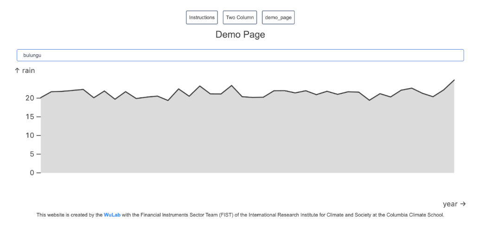

## Quick Summary (VS Code version)

- Make sure you've followed the [installation guide](/desdr-documentation/sliders/installation).
- `git checkout DRC_DEMO`
- Learn how to create routes for pages and update pages: Go to `routes > folder_name > +page.svelte`. To create a website tab, navigate to the `routes` folder and create a folder with a `+page.svelte` file. The folder name specifies the tab and the page. Svelte reserves space for individual components.
- **Data source is in:** Go to `static > .parquet` files.
    - **Why .parquet files?** Because it offers efficient compression and encoding schemes.
    - (Latency concerns with certain countries mean that it is currently optimal to load all the data, but potential future work to be done to link to databases instead of static files.)
- **Configure your component:** Go to `assets > configure.yml`
    - Think of your YAML file as the brain behind your website's data display and interactions. It tells your site where to get data, how to query it, and how to show it through charts and dropdown menus. You can adjust these settings to change what data is displayed and how it interacts with user inputs.

## Getting Started

- A computer with VS Code (continuing from the installation guide)
- Basic familiarity with the Terminal app
- Make sure you've followed the installation guide.
- We'll be working on the "DRC_DEMO" branch for this demo.

## Part 1: Adding a New Page with an Existing Component

### Set Up Your Workspace

- Switch to the "DRC_DEMO" branch:

    ```bash
    git checkout DRC_DEMO
    ```
    If you get an error about changes not being saved, use `git stash`.
- Check if you are in the correct branch using `git status`.
- Start your project with `npm run dev` and keep your DRC page open to see live updates.
- You should see: a page with 3 tabs - Instructions, Two Column, Demo_page.

### Creating Routes for Pages

- Navigate to the routes directory (on the left-hand side of VS Code): `Sliders/src/routes`.
- Remove the Instructions page by right-clicking on the folder and then pressing delete. You should see the Instructions tab disappear on the webpage.
- To create a `demo_page2` directory:
    - We have already set up this step in `demo_page`. Please retrace our steps and make the changes for your own learning.
    - While still in routes, create a folder named `demo_page2` using the create folder button on the top left of your VS Code.
    - Click on the folder you just created and create a file `+page.svelte` file.
    - Open the file, and you can start adding elements.
- You should see a `demo_page2` appear on your open webpage.

### Update Your Page

Once inside `+page.svelte`, this section is where you are reserving space for the individual components on the page. For this demo write:


You should see the name “Demo Page” appear on your page.
Try writing and changing the size of the header and the header name.
You will not see any line chart or dropdown, since important libraries are not imported.


You can just copy the libraries from the “Two Column” page but the minimalist version is above. Let's see what each one does and why it's important.

#### Internal Project Modules

- `import { backendLib } from "../../stores"`
    - **What it does:** Provides access to a Svelte store that holds the backend library instance.
    - **Why it's needed:** This is a global state container that allows different parts of your application to access the same data loading system. It ensures all components use the same backend instance for consistency.
    - **Technical note:** The $ syntax (`$backendLib`) is Svelte's way of accessing store values.

- `import { BackendLibrary } from "../../backend/index"`
    - **What it does:** The core data management system that handles loading and processing data files.
    - **Why it's needed:** This class loads your parquet files (like DRC_CHIRPS.parquet), runs SQL queries on them, and provides data to your charts. Without it, you have no way to access your data files.
    - **Key capability:** Handles DuckDB integration for querying parquet files.

- `import { Magic } from "../../magic"`
    - **What it does:** The central coordination system that connects data sources to visual components.
    - **Why it's needed:** Acts as the "brain" that manages the relationship between your data (backends) and your charts (views). It handles interactions, data flow, and component communication.
    - **Key responsibility:** Ensures when you select something in a dropdown, the chart updates with new data.

- `import { Config } from "../../config"`
    - **What it does:** Processes the configuration file and creates all the charts, dropdowns, and interactions.
    - **Why it's needed:** Reads your config.yml file and translates it into actual visual components. It's what turns selector: "#line" into a real chart in your `<div id="line" />` element.
    - **Key function:** The `init()` method actually creates and renders all your visualizations.

#### Asset Imports

- `import rawconfig from "../../assets/config.yml?raw"`
    - **What it does:** Imports the raw text content of your configuration file.
    - **Why it's needed:** Contains all the specifications for your charts - what type of chart, where to display it, what data to use, and how components interact with each other.
    - **The ?raw suffix:** Tells the build system to import the file as plain text rather than trying to process it.

#### Framework Functions

- `import { onMount } from "svelte"`
    - **What it does:** A Svelte lifecycle function that runs after the DOM elements are ready.
    - **Why it's needed:** Critical timing - your `<div id="line" />` and `<div id="dd" />` elements must exist in the DOM before the system tries to create charts inside them. Running chart creation too early results in "element not found" errors.

## Component Configurations

**Location:** `assets > config.yml`

Your YAML file is like a recipe that tells your website how to display data and interact with users. It's divided into four main parts:

1. **Data Sources (Backends)**
    - **What It Is:** This section lists where your data comes from. In our case, we're using data stored in `.parquet` files. Why not .csv? Because .parquet files offer efficient compression and encoding schemes.
    - **What to Know:** These files are in a folder named `static`. Each file has a unique name that the website refers to when pulling data.
2. **Data Queries (Query)**
    - **What It Is:** Here, you define what data to show using SQL queries. Our example, `demo_query`, averages rainfall (`chirps`) by year and territory from the "DRC_CHIRPS" dataset.
    - **What to Know:** You can tweak this query, like changing the territory or date range. We've set a default territory (`bulungu`) to simplify interactions, but you can adjust this as needed.
3. **Display Components (Views)**
    - **Line Chart:** This part sets up a line chart (`LineArea`) showing rainfall over the years.
        - **Key Details:** You choose what data appears on the x-axis (`year`) and y-axis (`rain`). It pulls data from `demo_query`.
        - **Customization:** The chart's place on the page is marked by a unique ID (`#line`). You can change this ID if you rename the chart in your webpage's code.
    - **Dropdown Menu:** This sets up a dropdown menu to let users choose different territories.
        - **Key Details:** It starts with one option (`index: 0`) and lists territories from "DRC_CHIRPS".
        - **Interactivity:** When a user picks a territory, the chart updates to show data for that choice.
4. **Making it interactive (Interactions)**
    - **What It Is:** This part connects your dropdown menu to the line chart. When someone selects a territory, the chart shows the rainfall data for that area.
    - **What to Know:** This is set up under `interactions` with a change type, meaning the chart's data changes based on the dropdown's selection.


## Edit Your Demo Page

Back in your demo page:

```bash
cd ../src/routes/demo_page
```

In `+page.svelte`, make room for a new interactive component, like a dropdown button.


## Update the Config File Again

In `../src/assets/config.yml`, add a new dropdown item. Ensure the dropdown's ID matches what you named your `div` in the routes folder. Configure it to display territory information.



Your dropdown should be fully functional now, but there is currently no connection between the dropdown and the chart.

## Enable Interactivity

In the config, link the dropdown to the chart so that selecting a territory updates the chart data. Please note that this step is already done in the config page, but you can try deleting and writing the dropdown view to understand the code better.


You've now added a new page with a static and an interactive component, making your site more dynamic. Congratulations!
